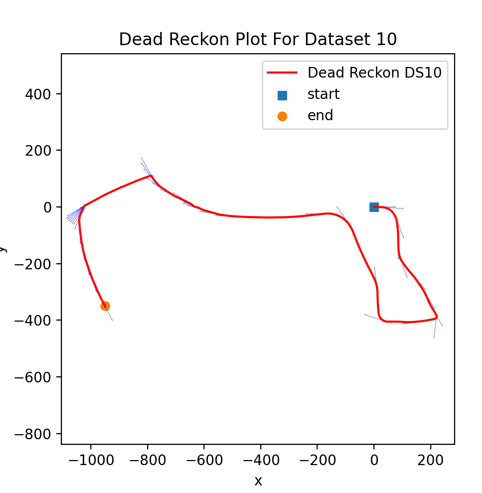
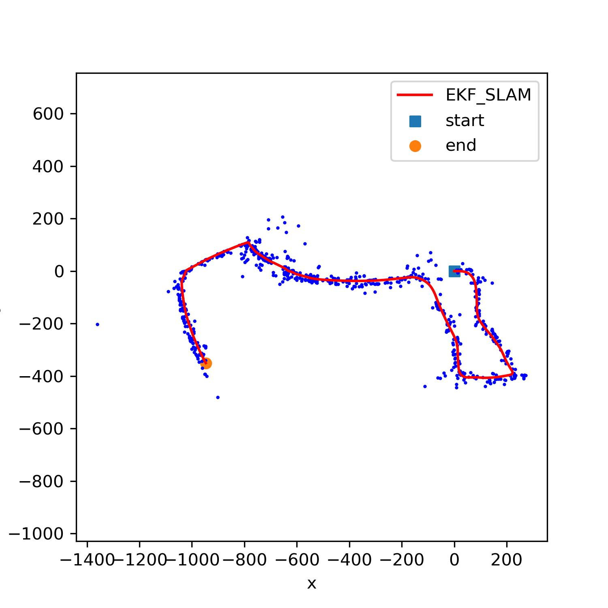

# Visual Inertial SLAM
## Overview
This project is a part of coursework Sensing and Estimation done in Spring 2023.
This code implements EKF SLAM for a car that is equipped with stereo camera and IMU sensors. Motion model using IMU measurements was used to localise the robot and the image features collected from stereo camera was used to map the environment. 

We have 2 sets of data obtained from a mobile robot. All the data was time synced beforehand. Each sets contain the following data:
- Inertial Measurement Unit: A 3 * N matrix containing linear velocity and a 3 * N matrix containing angular velocity measurements from a IMU sensor is provided. There are N timesteps.
- Intrinsic calibration: The stereo camera baseline b and a 3 × 3 matrix containing the calibration values of the camera is provided.
- Timestamps is given as a N vector in unix timestamp format.

## Results
|           Dead Reckon Trajectory            |
| :-------------------------------------: |
|  |

|           VI SLAM Output            |
| :-------------------------------------: |
|  |

## Code Implementation
### 1. src/main.py
This is the main entry point to the algorithm.

### 2. src/EKF_Deadreckon.py
This file contains a function which implements dead reckoning of the sensor values

### 3. src/EKF_Mapping.py
This file contains functions that does mapping update with assuming localisation is provided by dead reckon trajectory.

### 4. src/EKF_SLAM.py
This file contains functions that does both localisation and mapping by implementing EKF prediction and update step.

### 5. src/EKF_helper.py
This file contains functions that implements motion model, observation model, transformations from rotation to axis angle and back.

### 6. src/utils.py
This file contains functions that implements functions to transform sensor values and correlate between features.

### 7. data
Folder which contains input data.

### 8. results
Folder that stores the output plots.
